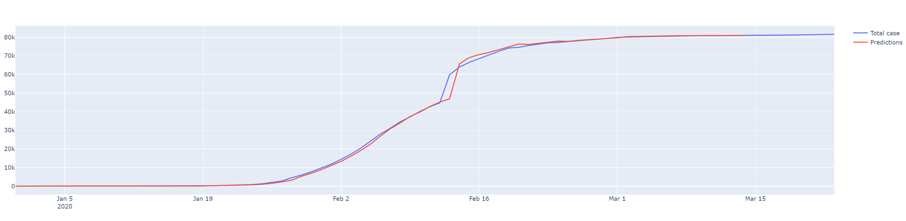
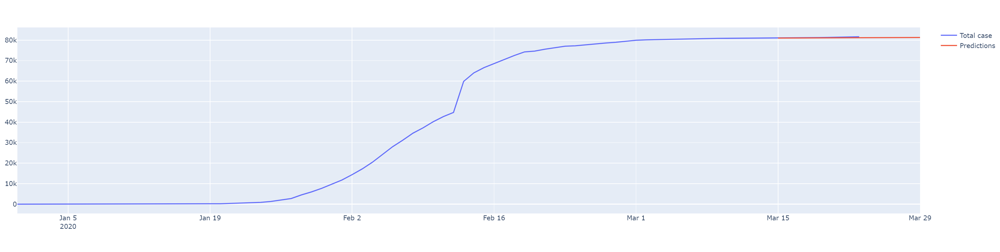

# Coronavirus prediction with Machine Learning

It's a jupyter notebook that use some Machine Learning methods in order to predict the number of deaths etc.. in all country.
  - Toral of confirmed cases
  - Total of death cases
  - Algeria cases

# New Features!

  - You can choose dynamically many parameters
  - The datasets is from this [link1](https://covid.ourworldindata.org/data/ecdc/total_cases.csv), [link2](https://covid.ourworldindata.org/data/ecdc/total_deaths.csv)

# How to use:
  - Go to [Google Colab](https://colab.research.google.com/)
  - Import the Jupyter file (Covid_19_all.ipynb)
  - Click on execution
  - Then click on execute all
 
### Some images of China predictions

### Installation

No installation nedeed, just run on Google Colab

License
----

Mohammed Amin BELARBI
